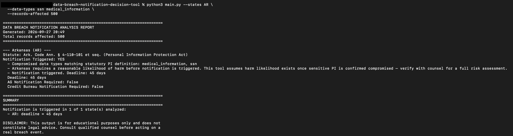

# Data Breach Notification Decision Tool

A command-line tool that analyzes a hypothetical data breach scenario against a
representative subset of U.S. state data breach notification statutes
(California, New York, Texas, and Arkansas) and determines:

- Whether individual notification is legally triggered
- Applicable notification deadlines
- Whether Attorney General notification is required
- Whether consumer credit reporting agency notification is required

This project was built to demonstrate the intersection of legal analysis and
software engineering — specifically, how state breach notification statutes
(each with different triggers, thresholds, and exceptions) can be modeled as
structured, machine-readable rules rather than left as unstructured legal text.

---

## Why this project exists

Data breach notification law is one of the more fragmented areas of U.S.
privacy compliance — there is no single federal breach notification standard,
so companies must navigate up to 50 different state statutes, each with its
own definitions, thresholds, and deadlines. This tool is a small proof-of-concept
showing how that patchwork could be codified into a structured decision engine,
using four states with meaningfully different legal mechanics:

| State      | Notable characteristic                                                   |
|------------|----------------------------------------------------------------------------|
| California | No fixed deadline; "most expedient time possible"                        |
| New York   | Regulator notice requires filing with AG **and** NY State Police         |
| Texas      | Fixed 60-day statutory deadline                                          |
| Arkansas   | Risk-of-harm trigger (notice not required absent likelihood of harm) and **no** credit bureau notification requirement |

---

## ⚠️ Disclaimer

This tool is for **educational and portfolio purposes only**. It is **not**
legal advice, and it should not be relied upon for actual breach response
decisions. Breach notification law changes frequently, and this dataset
reflects a snapshot of statutory research as of the `last_verified` dates
in `data/breach_notification_rules.json`. Always consult qualified legal
counsel before making real-world compliance decisions.

---

## How it works

The project separates **legal knowledge** from **decision logic**:

- `data/breach_notification_rules.json` — a structured dataset encoding each
  state's statutory citation, personal information definitions, encryption
  safe harbor rules, notification thresholds, deadlines, and regulator/credit
  bureau notification requirements.
- `main.py` — a rules engine that ingests the JSON dataset and evaluates a
  user-supplied breach scenario against each selected state's rules,
  producing a structured, human-readable report.

This mirrors how real-world regulatory technology (RegTech) tools are
typically architected: legal research is maintained as versioned, auditable
data, while application logic remains stable and testable independent of
changes in the underlying law.

---


## Screenshot:

**Example: Python Command and one state output**



## Usage

### Requirements
- Python 3.9+
- No external dependencies (standard library only)

### Running the tool

```bash
python main.py \
  --states CA NY TX AR \
  --data-types ssn medical_information \
  --records-affected 5000 \
  --encrypted \
  --key-compromised
